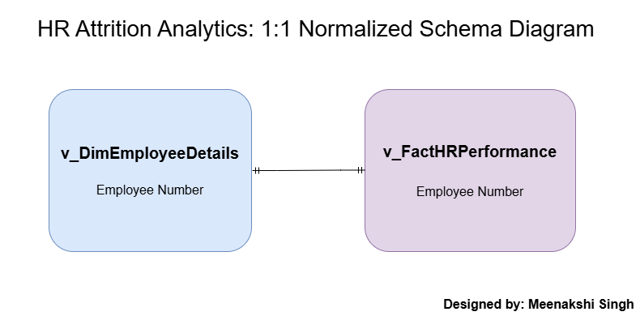

# IBM HR Analytics: Strategic Workforce Insights Dashboard

## Project Overivew

An enterprise-grade Business Intelligence and Data Engineering solution that transforms raw, flat HR transactional data into a highly optimized, interactive 5-page Power BI Executive Suite. This project showcases end-to-end data professional capabilities, spanning from **T-SQL database normalization and view engineering** to **dimensional modeling, business analytics, and executive UI/UX design**.

---

## 🚀 Quick Access Portfolio Assets

Use the links below to instantly jump to specific project components, source scripts, and high-resolution deployment assets:

* 📊 **[Power BI Dashboard File (.pbix)](Report_and_Dashboard/IBM_HR_Analytics_Strategic_Dashboard.pbix)**
* 📄 **[Executive Summary Report (PDF)](Report_and_Dashboard/IBM_HR_Analytics_Strategic_Dashboard.pdf)**
* 🗃️ **[Raw Transactional Dataset (CSV/XLSX)](Source_Data/HR-Employee-Attrition.csv)**
* 🛠️ **[Database Engineering Scripts (SQL)](Sql_Scripts/02_Gold_Reporting_Views.sql)**

---

## 📐 Data Architecture & Modeling

To implement formal data warehousing practices from a flat-file source, the database layer was intentionally normalized from a single master table into a clean, decoupled **1:1 Dimensional Model**. This separation isolates quantitative operational metrics from descriptive employee profiles, streamlining model management and keeping analytical measures decoupled from descriptive attributes.

* **Central Fact Table (`FactHRPerformance`):** Stores core operational, quantitative metrics, transaction keys, and performance tracking attributes.
* **Master Dimension Table (`v_DimEmployeeDetails`):** Houses all core descriptive employee profiles, workplace sentiment scores, job roles, and demographics.

### 🖼️ Schema Architecture

### 🔌 Relationship Logic:
* `v_DimEmployeeDetails[EmployeeNumber]` ↔️ `FactHRPerformance[EmployeeNumber]` ($1:1$)

*(Note: The relationship is modeled with a 1:1 join on the primary key, optimizing filter propagation and reducing memory overhead within the VertiPaq columnar engine.)*

---

## 🖥️ Interactive BI Suite: Page-by-Page Visual Architecture

Click on any module below to view the high-resolution preview directly from the assets folder.

| Module | Analytical Focus | High-Res Preview |
| :--- | :--- | :--- |
| **01. Home Page** | Acts as a centralized navigation hub segmenting user exploration across 4 core operational pillars. | [🖼️ View](./Assets/01_Home_Page.png) |
| **02. Executive Overview** | Monitors cross-functional organizational health, core headcount KPIs, and high-level attrition concentrations. | [🖼️ View](./Assets/02_Executive_Overivew.png) |
| **03. Demographic & Diversity** | Examines employee distance from home, academic backgrounds, and overtime exposure across demographic cohorts. | [🖼️ View](./Assets/03_Demographics_&_Diversity.png) |
| **04. Performance & Reward** | Evaluates training investment payoffs, promotional frequencies, and retention risks via stock equity tracking.| [🖼️ View](./Assets/04_Performance_&_Reward.png) |
| **05. Sentiment & Workplace Risk** | Diagnoses workplace culture health by tracking turnover velocity against supervisor changes and job satisfaction. | [🖼️ View](./Assets/05_Sentiment_&_Workplace.png) |

### 1. Executive Navigation Portal (Home Page)
The suite opens to a high-end landing portal designed to establish immediate visual hierarchy and provide a structured, intuitive path for user exploration.
* **Business Objective:** Prevent dashboard fatigue by avoiding immediate data overload. Instead, it segments user focus into four distinct corporate strategic pillars.
* **UX/UI Highlights:** * Implements interactive custom button cards equipped with active page navigation actions and cohesive iconography.
  * Employs a cohesive dark mode interface utilizing clear neon bounding borders to reduce visual friction.
  * Explicit user prompts (*"Ctrl + Click a category to begin your analysis"*) to guide technical desktop reviewers seamlessly.

### 2. Executive Overview
The macro-level nerve center of the application, providing executive stakeholders with a cross-functional breakdown of organizational health, compensation baselines, and retention metrics.
* **Business Objective:** Offer immediate visibility into critical C-suite KPIs while establishing a clear baseline for deeper behavioral analysis.
* **Core Analytics & Visuals:**
  * **Strategic KPIs:** Tracks overall headcount alongside an active Attrition Rate % and an engineered Retention Cost Index.
  * **Demographic Cross-Section:** A dual-axis clustered column chart illustrating headcount distribution segmented simultaneously by age bands and gender.
  * **Compensation vs. Longevity Correlation:** A high-density scatter plot mapping monthly income directly against employee tenure years, color-coded by attrition status to reveal systemic departure zones.
  * **Turnover & Equity Snapshots:** Donut and horizontal bar charts isolating departmental turnover concentration and performance-based compensation equity.

### 3. Demographic & Diversity 
A granular operational matrix focused on structural demographics, equity compliance metrics, and lifestyle attrition drivers across the talent pipeline.
* **Business Objective:** Uncover underlying systemic risks related to employee commute burdens, gender pay equality, and work-life distribution.
* **Core Analytics & Visuals:**
  * **Socioeconomic KPIs:** Highlights structural diversity percentages alongside an engineered Gender Pay Gap Ratio ($0.95x$) and a high-risk long-commute headcount indicator.
  * **Acquisition Pipe Analysis:** A dynamic Treemap categorizing the foundational volume of the workforce by academic concentration and specialization fields.
  * **The Commute Correlation:** A trended column chart tracking turnover risk percentage against raw distance from home, mathematically modeling the negative retention impact of extensive travel times with a centralized trendline.
  * **Operational Overtime Exposure:** A stacked horizontal bar chart breaking down overtime utilization across marital cohorts to isolate burnout risks.

### 4. Performance & Reward 
A specialized financial and talent optimization matrix designed to evaluate corporate total rewards strategies, compensation distribution equity, and performance incentives.
* **Business Objective:** Analyze whether historical salary increases, promotional frequencies, and equity packages successfully retain high-performing individuals and critical operational personnel.
* **Core Analytics & Visuals:**
  * **Compensation KPIs:** Displays overarching benchmarks including Average Salary Hike %, Promotional Velocity (years between promotions), and Top Performer Retention rates.
  * **Upskilling Payoff Evaluation:** A dual-axis combo chart analyzing training frequency investment alongside the resulting average salary hikes across individual job roles.
  * **Promotional Velocity Bottlenecks:** A horizontal bar chart isolating the average time employees wait for promotions across major corporate business units.
  * **The "Golden Handcuffs" Matrix:** A cross-tabulated heatmap matrix intersecting job roles against long-term Stock Option Tiers (None, Basic, Standard, Executive) to track live attrition gaps.

### 5. Sentiment & Workplace Risk
A deep-dive psychological behavioral matrix focusing on workplace cultural health, leadership tenure stability, and early-tenure burnout vulnerabilities.
* **Business Objective:** Diagnose the soft risks within the company culture, tracking how manager changes, satisfaction scores, and over-utilization drive rapid voluntary departures.
* **Core Analytics & Visuals:**
  * **Cultural Health KPIs:** Monitors critical risk metrics including an active Burnout Risk Count, an early-stage First Year Attrition % threshold, and an aggregated Manager Stability Index.
  * **The New Manager Threshold:** A high-resolution clustered column chart mapping attrition waves directly against supervisor tenure, isolating leadership transition risks.
  * **Early-Tenure Turnover Velocity:** A segmented horizontal bar chart tracking attrition risks by standardized tenure cohorts, exposing high-risk zones within the first 12 months.
  * **Overtime Impact Comparison:** A clustered column chart tracking raw employee counts across individual Job Satisfaction levels, directly split by Overtime Status (`Yes`/`No`) to eliminate matrix clutter and showcase the stark impact of work hours on morale.

---

## 🛠️ Technology Stack & Tools
* **Data Transformation / Engineering:** SQL Server / T-SQL (Custom Views)
* **Data Modeling & Analytics Engine:** Power BI Desktop, Tabular Engine
* **Advanced Calculations:** DAX (Data Analysis Expressions)
* **Schema Wireframing:** Draw.io
* **UI/UX Design Framework:** Custom Figma Grid System, Dark Minimalist Theme

---

## 📋 How to Replicate and Run This Project
1. Clone this repository to your local directory.
2. Execute the database scripts in your SQL Server instance to generate the required Views (`v_DimEmployeeDetails` and `FactHRPerformance`).
3. Open the `.pbix` file using Power BI Desktop.
4. Navigate to **Home > Transform Data > Data Source Settings** and change the file paths or SQL connection to map to your local instance.
5. Hit **Refresh** to populate the data model.

---

**Author: Meenakshi Singh**
*Data Analyst | SQL Engineering | Power BI Architecture | Advanced Excel Dashboards* 
[LinkedIn](https://www.linkedin.com) | [GitHub Portfolio](https://github.com)

