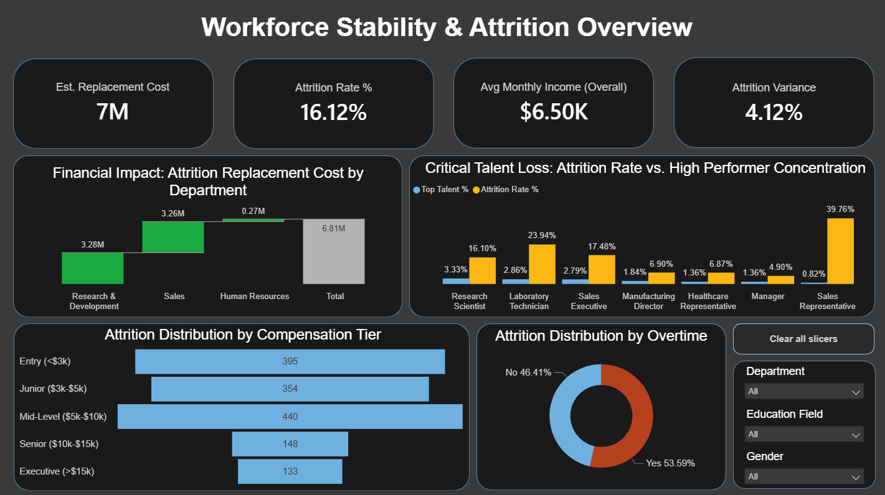
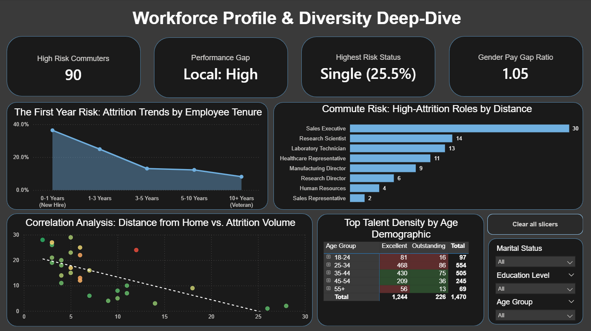
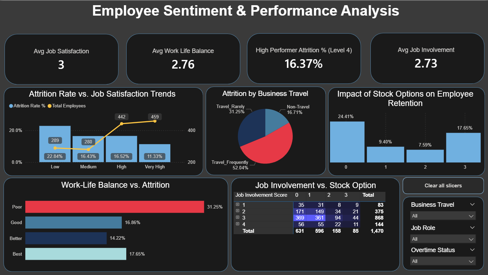
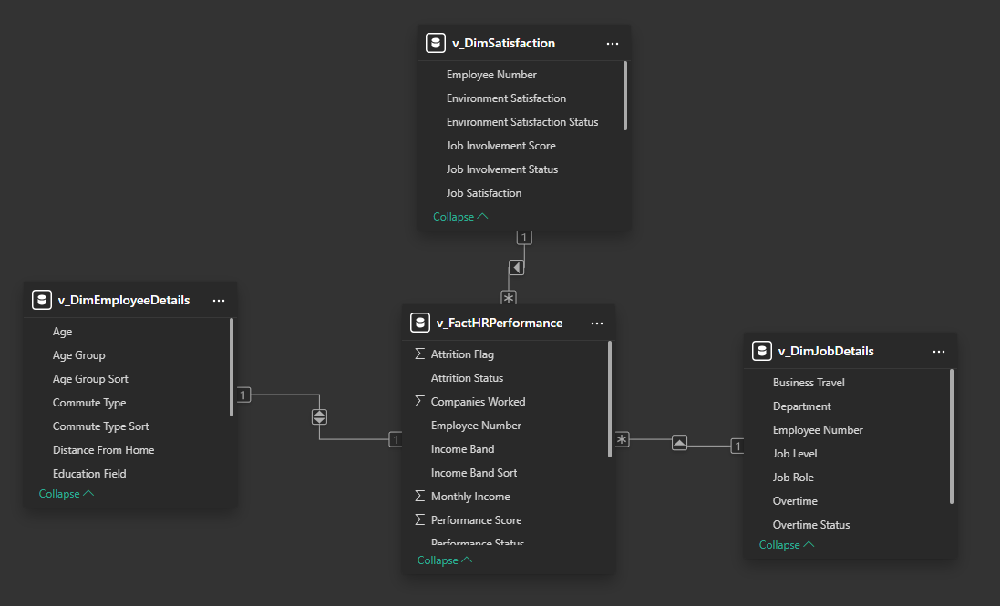

# HR People Analytics: Strategic Workforce Insights

## 📋 Project Overview
This project features a comprehensive 4-page Power BI dashboard designed to help HR leadership understand employee turnover (attrition) and workforce health. By analyzing the **IBM HR Analytics dataset**, this dashboard identifies the key drivers behind employee departures and provides actionable insights for improving retention.

---

## 🚀  Documentation & Quick Links

* 📊 **[Download Power BI Dashboard (.pbix)](Report_and_Dashboard/IBM_HR_Analytics_Strategic_Dashboard.pbix)** - *Requires Power BI Desktop to view data model and DAX*
* 📄 **[Download Project Summary (PDF)](Report_and_Dashboard/IBM_HR_Analytics_Strategic_Dashboard.pdf)** - *A comprehensive report of insights and methodology*
* 💻 **[View SQL Scripts](Sql_Scripts/Gold_Layer_Views.sql)** - *Database views and transformation logic*
* 🗄️ **[Source Data (.csv)](Source_Data/HR-Employee-Attrition.csv)**

  ---
  
## 🖥️ Dashboard Preview

### 1. Navigation Home Page
Designed for a seamless user experience, allowing stakeholders to jump to specific analytical deep-dives.

### 2. Executive Overview
A high-level summary of attrition rates, headcount distribution, and salary brackets.

### 3. Demographics & Diversity
A deep dive into age groups, education fields, and commute distances to identify high-risk profiles.

### 4. Employee Sentiment & Performance
Analyzes the "human" element—linking job satisfaction, work-life balance, and stock options to retention.

---

## 🛠️ Technical Implementation

### 1. Data Modeling (Star Schema)
I developed a robust **Star Schema** to optimize report performance and ensure data integrity. This structure allows for complex filtering across multiple dimensions without sacrificing speed.
* **Fact Table**: `v_FactHRPerformance` containing core metrics.
* **Dimension Tables**: `v_DimEmployeeDetails`, `v_DimJobDetails`, and `v_DimSatisfaction`.

### 2. Advanced DAX & Power Query
* **Custom Sorting**: Solved alphabetical sorting issues for qualitative data (e.g., Work-Life Balance: Poor $\rightarrow$ Best) by creating a **Conditional Column Index** in Power Query to break circular dependencies.
* **Dynamic Measures**: Created measures for Attrition Rate %, Average Monthly Income, and Job Involvement Scores to provide real-time KPIs.

### 3. UI/UX Optimization
* **Descriptive Titles**: Updated charts with insight-driven titles like "Attrition Risk by Commute Distance" to provide immediate value to the reader.
* **Interactive Navigation**: Implemented button-based navigation and slicer resets to make the report feel like a native application.

---

## 📈 Key Insights

* **Overtime Impact**: Employees working overtime show a significantly higher attrition rate (53.59%) compared to those who do not, suggesting burnout is a primary driver.
* **Tenure Risk**: New hires (0-1 years) show the highest attrition density, highlighting the importance of the first-year onboarding experience.
* **Work-Life Balance**: A clear correlation exists between balance ratings and retention; as ratings move from "Poor" to "Best," attrition drops significantly.

---

## 📂 Repository Structure

* **`Assets/`**: High-resolution PNGs and Data Model architecture screenshots.
* **`Report_and_Dashboard/`**: Full PDF report and the `.pbix` source file.
* **`Source/`**: Raw IBM HR dataset used for the analysis.
* **`Sql_Scripts/`**: T-SQL scripts used for data profiling and transformation logic.

---

### 💡 How to use this repository
1. Download the `.pbix` file to explore the interactive DAX measures and data model.
2. View the `03_Report_and_Dashboard` folder for a quick PDF overview of the findings.
3. Review the `Sql_Scripts` to see the underlying data preparation.

   ---
